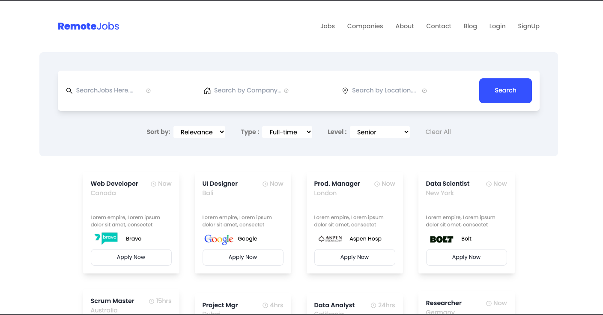
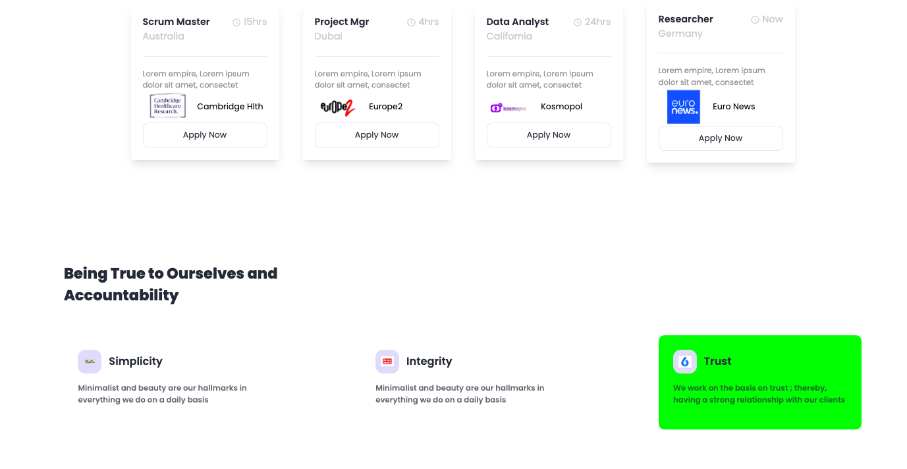

# Remotejobs-React

<!-- {*/Second part*/} -->
###### Second part of Body

<!--  -->

Website built with React for jobs

npm create vite@latest remotejobs --template React

choose dependencies React

choose variant Javascript

cd remotejobs

npm install

npm run dev

# Installing Tailwind css
Click on get started once you get on the Tailwind website
Framework : choose Vite

npm install -D tailwindcss postcss autoprefixer

npx tailwindcss init -p

Open tailwind.config.js file and edit so your final code looks like below

`/** @type {import('tailwindcss').Config} */

module.exports = {
  content: [
     "./index.html",
    "./src/**/*.{js,jsx}",
  ],
  theme: {
    extend: {},
  },
  plugins: [],
}
`
